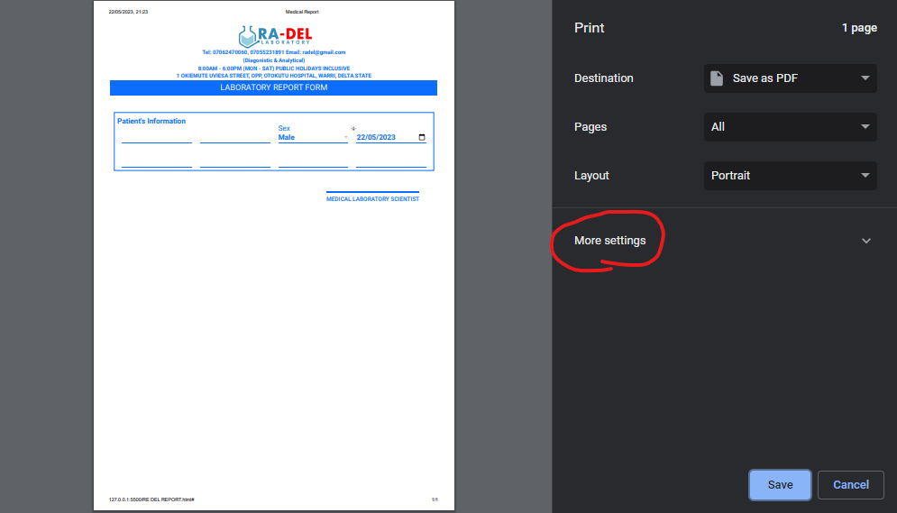
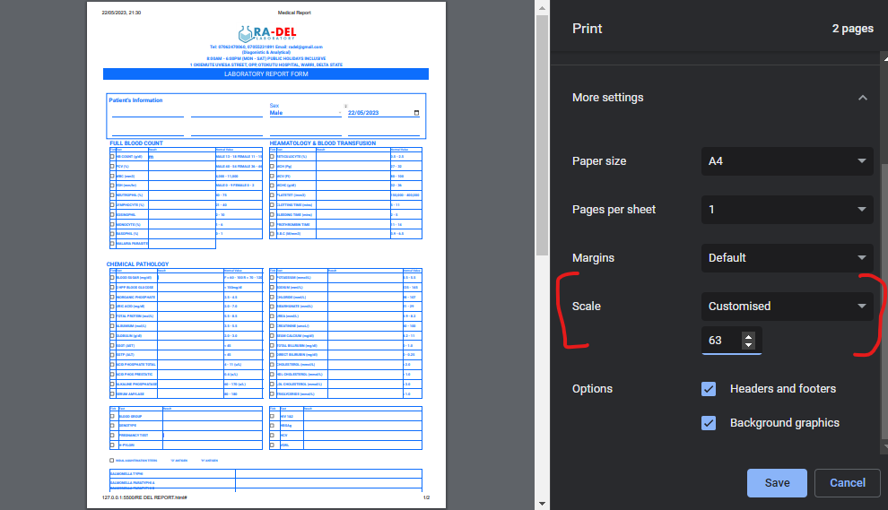

# Medical Report
Printing of medical report made easy. This site gives you controll to print what ever section you filled and remove the section not filled

## What are the sections
This site comprises of the following sections
- FULL BLOOD COUNT / HEAMATOLOGY & BLOOD TRANSFUSION
- CHEMICAL PATHOLOGY
- URINALYSIS
- SERMINAL ANALYSIS
- MICROBIOLOGY
- CFS MICROSCOPY

### Usage
A HTML static website that allows it's user to fill in medical result for any test carried out by a patient. When the selected test are filled up then the section of test which were not filled will be omited from the printer

Example of Mediacl report containing all report section

## Printing
Printing the result would require the user to select the scale for the current file. For example if up to 3 sections are selected then the print would contain up to 4 pages on default. So it is best for the user to set the scale for the print. You can find the scale option in the "More Settings"

##### Note
When printing all section the best scale is between (59-63). Do well to adjust it to your liking

Also make sure that "Background Graphics" is checked